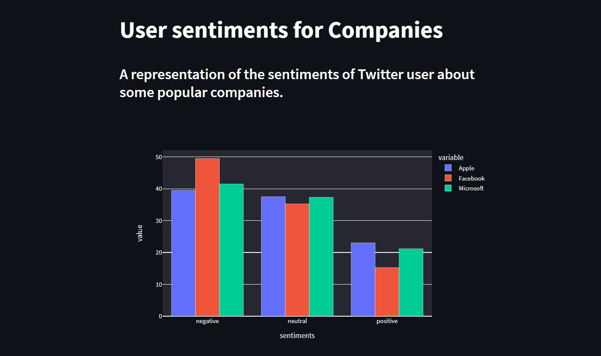

# User Sentiments Visualizer
Visualize Twitter user sentiments for popular companies every week or month.



## Project setup
There are a few things that are needed to be done before starting the containers.
1. Since we are using firebase, make a firebase project and create a realtime database. 
2. Then download the **KEY.json** file and save it inside the `api/` directory.
3. Add the *companies* name to the `scraper/config/config.yml` file.
4. Run the *jupyter* notebook to download the model and save them to models directory inside the **classification** service.

## How to Run
1. Clone the repository
   ``` 
   $ git clone <url>
   ```
2. Get inside the cloned directory
   ```
   $ cd <directory>
   ```
3. Run the jupyter notebook to download the **Hugging face** model
4. Add companies name to the `scraper/config/config.yml` file. 
5. Run docker-compose.yml to start the project
6. 
   ```
   $ docker compose up --build
   ```
