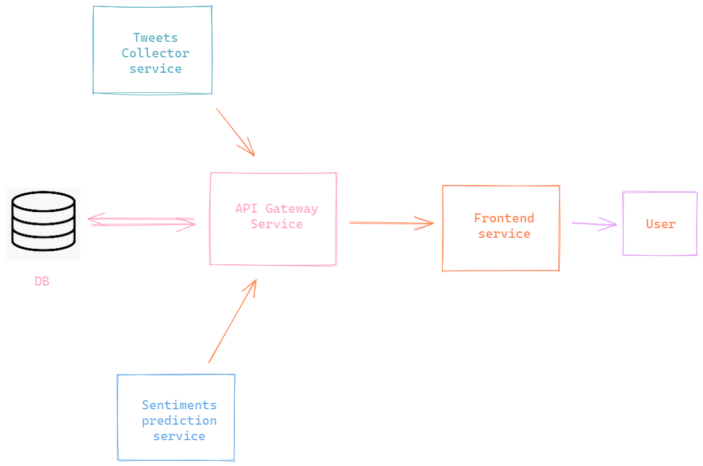

# User & Company relationship visualizing application
Visualize user sentiments for popular companies every week or month.


## Project architecture


Let's understand the services in brief.

- **API service** - An api gateway that manages all key data calling functionalities and creates a single point access for other microservices. 
- **Scraper** - The tweets scrapping microservice, whose only purpose is to get tweets from Twitter and store them inside a database. 

   Since, the scraper requirement is only once or twice a month, there is no need for a streaming service. That is the reason why a database is considered more easy and simple than any other real-time tool like Kafka.
- **Classification** - The classification service uses Hugging face model for sentiment prediction of the tweets. Then the percentage of the different sentiments are calculated and store inside a database. 
- **Frontend** - The sentiments, stored on the database, are fetched by the frontend service and displayed to the users in the form of charts.


## Project setup
There are a few things that are needed to be done before starting the containers.
1. Since we are using firebase, make a firebase project and create a realtime database. 
2. Then download the `<key>.json` file and save it inside the `api/` directory.
3. Add the *companies* name to the `scraper/config/config.yml` file.
4. Run the *jupyter* notebook to download the model and save them to models directory inside the `classification/` service.

## How to Run
1. Clone the repository
   ``` 
   $ git clone <url>
   ```
2. Get inside the cloned directory
   ```
   $ cd <directory>
   ```
3. Run the jupyter notebook to download the **Hugging face** model
4. Add companies name to the `scraper/config/config.yml` file. 
5. Run `docker-compose.yml` to start the project
   
   ```
   $ docker compose up --build
   ```
